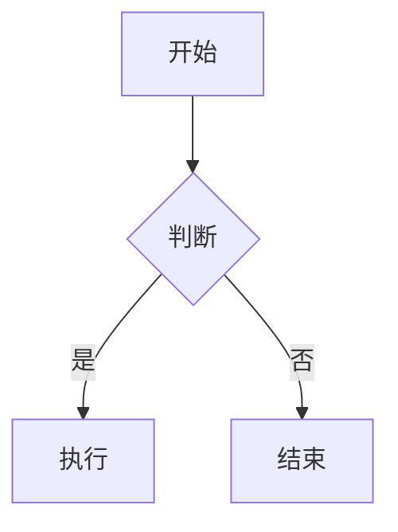

# md2wechat Skill

<div align="center">

**用 Markdown 写公众号文章，像发朋友圈一样简单**

[](https://python.org)
[](LICENSE)

[快速开始](#-5分钟快速上手) • [功能介绍](#-核心功能) • [进阶配置](#-进阶配置) • [常见问题](#-常见问题)

---

</div>

## ✨ 这是什么？

**md2wechat** 是一个全流程的公众号自动化写作助手。它不仅仅是排版工具，更能帮你搞定配图、页脚甚至自动上传。

> 💡 **一句话理解**：Markdown 写作 → AI 自动配图 → 智能排版 → 自动发到微信草稿箱

**核心亮点：**
*   🎨 **智能排版**：支持卷轴、科技、极简等多种风格，自动适配 CSS。
*   🖼️ **AI 配图**：集成 ModelScope，根据文章内容自动生成封面和插图。
*   📊 **卡片渲染**：自动将 Mermaid 流程图、HTML 代码块渲染为高清图片，完美适配手机。
*   🦶 **动态页脚**：一键注入动态 SVG 分隔符、二维码和往期推荐。
*   🚀 **自动发布**：直接上传图片和草稿到微信公众号后台。

---

## 🚀 5分钟快速上手

### 1. 环境准备
确保你安装了 Python 3.8+。

```bash
# 克隆仓库
git clone https://github.com/geekjourneyx/md2wechat-skill.git
cd md2wechat-skill

# 安装依赖
pip install -r requirements.txt
playwright install chromium
```

### 2. 初始化配置
运行交互式向导，配置 API Key 和公众号信息：

```bash
python setup.py
```
*按照提示输入 ModelScope API Key（用于生图）和 微信公众号 AppID/Secret（用于上传）。*

### 3. 开始写作
新建一个 Markdown 文件（例如 `article.md`），支持在头部定义配置（Frontmatter）：

```markdown
---
theme: chinese-scroll       # 排版主题：chinese-scroll, cyber, brutalism, twilight, default
cover:
  prompt: "一只在写代码的猫" # 封面图提示词
  style: ink                # 封面风格：ink (水墨), sci_fi (科幻), impressionism (印象派)
footer:
  template: glass_contact   # 页脚模板
  title: "联系作者"
---

# 我的第一篇文章

这里是正文内容...
```

### 4. 一键生成与发布
运行构建脚本：

```bash
# 仅生成 HTML 预览
python skill/md2wechat/scripts/build.py article.md

# 生成并自动上传到微信草稿箱
python skill/md2wechat/scripts/build.py article.md --upload
```

---

## 🎨 核心功能详解

### 1. AI 风格化生图
支持多种预设风格，只需在 Frontmatter 中指定 `style`：
*   `tech` / `sci_fi`: 科技感、赛博朋克
*   `art` / `ink`: 中国风水墨、艺术感
*   `cute` / `pop`: 活泼可爱、3D 渲染
*   `industrial`: 工业风、故障艺术

### 2. 智能卡片渲染
在 Markdown 中使用代码块，会自动渲染为精美卡片：

**Mermaid 流程图：**


**HTML 卡片：**
```html
<!-- 自动渲染为 Apple 风格玻璃卡片 -->
<div class="card">...</div>
```

### 3. 动态页脚注入
在 `md2wechat.yaml` 或 Frontmatter 中配置页脚，支持：
*   **Wave**: 动态波浪分隔符
*   **Neon**: 霓虹脉冲分隔符
*   **Glass Contact**: 磨砂玻璃质感名片（含二维码）

---

## ⚙️ 进阶配置

### 全局配置 (`md2wechat.yaml`)
`setup.py` 会自动生成此文件，您也可以手动修改：

```yaml
image_key: "sk-xxxx"      # ModelScope API Key
app_id: "wx-xxxx"         # 微信公众号 AppID
app_secret: "xxxx"        # 微信公众号 AppSecret

footer:
  template: "glass_contact"
  separator_style: "wave"
  title: "我的公众号"
  subtitle: "专注技术分享"
  qr_image: "https://example.com/qr.jpg"
  links:
    - text: "往期文章 1"
      url: "https://..."
```

### 命令行工具
*   `md2wechat.bat`: Windows 下的快捷启动脚本。
*   `skill/md2wechat/scripts/generate_image.py`: 单独测试 AI 生图。
*   `skill/md2wechat/scripts/render_visual.py`: 单独测试卡片渲染。

---

## ❓ 常见问题

**Q: 为什么上传失败？**
A: 请检查 `md2wechat.yaml` 中的 `app_id` 和 `app_secret` 是否正确，且服务器 IP 已加入公众号白名单。

**Q: 图片生成失败？**
A: 请确保 `image_key` 正确，且 ModelScope 账户有余额（或免费额度）。

**Q: 依赖安装报错？**
A: 确保 Python 版本 >= 3.8，且已运行 `playwright install chromium`。

---

*Maintainer: @neo1_95*
